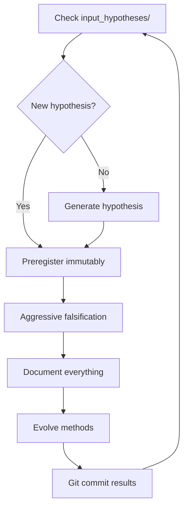

# 🔬 Autonomous Falsification-First Scientific Discovery System

A revolutionary GitHub-based framework where AI agents autonomously conduct rigorous scientific research through systematic falsification, creating an evolution-proof system that improves with AI advancement.

## 🎯 Core Innovation

This system implements **autonomous scientific agents** that:
- ❌ **Falsify aggressively** - Default assumption: every hypothesis is wrong
- 📈 **Evolve methodologies** - Continuously improve their falsification strategies  
- 🔒 **Maintain immutable records** - Git-based memory ensures perfect reproducibility
- 🚀 **Scale with AI progress** - Designed to get BETTER as AI improves

**Success Metric**: >70% hypothesis rejection rate (high rejection = healthy science)

## 🏗️ System Architecture

```
Autonomous-Falsification-System/
├── input_hypotheses/         # 📥 Drop hypotheses here for testing
├── work_in_progress/        # 🔄 Active falsification attempts
├── validated_findings/      # ✅ Results (rejections celebrated!)
├── archived_attempts/       # 📚 Failed experiments & lessons
├── cycle_outputs/          # 📤 Timestamped research cycles
├── capabilities/logs/      # 📊 Performance metrics
├── meta_instructions/      # 🧠 System design documents
└── .github/workflows/      # 🤖 Automation & monitoring
```

## 🚀 Quick Start

### 1. Deploy an Agent

Simply send the agent instructions (found in `00-AGENT_INSTRUCTIONS.md`) to any capable AI system. The agent will:

1. **Self-initialize** and check for pending work
2. **Begin falsification cycles** immediately  
3. **Generate hypotheses** if none are pending
4. **Evolve its methods** based on results

### 2. Submit a Hypothesis

Create a markdown file in `input_hypotheses/`:

```markdown
# Hypothesis: [Your Falsifiable Claim]

## Specific Prediction
[What measurable outcome do you predict?]

## Falsification Criteria  
[What result would prove this wrong?]

## Why This Matters
[Brief context]
```

### 3. Watch Science Happen

Agents will:
- 🔒 **Preregister** the hypothesis (locked criteria)
- 🔬 **Attack** it from multiple angles
- 📊 **Document** all results transparently
- 🎉 **Celebrate** rejections as successes

## 📋 How It Works

### The Falsification Loop



### Key Principles

1. **Preregistration is Sacred** - Success criteria locked before testing
2. **Negative Results = Success** - Rejections prevent wasted effort  
3. **Evolution Through Selection** - Methods that find more errors survive
4. **Cryptographic Truth** - Git ensures tamper-proof records

## 📊 Monitoring Scientific Integrity

Check system health:

```bash
# View rejection rate (should be >70%)
python capabilities/check_falsification_metrics.py

# See recent falsification attempts  
git log --grep="REJECTED:" --oneline

# Track methodology evolution
git log --grep="EVOLUTION:" --oneline
```

## 🧬 Evolutionary Capabilities

The system improves itself by:

1. **Generating method variants** (statistical tests, sample sizes, etc.)
2. **Testing effectiveness** on known-false hypotheses
3. **Selecting high-performers** based on error detection
4. **Falsifying its own selection** to prevent bias

This creates a **meta-falsification loop** where the system questions even its own improvement strategies.

## 🎖️ Why This Matters

Traditional research suffers from:
- ✅ Confirmation bias (seeking supporting evidence)
- ✅ P-hacking (manipulating statistics)  
- ✅ Publication bias (hiding negative results)
- ✅ Validation theater (appearing rigorous without being so)

This system **structurally prevents** these issues through:
- ❌ Default skepticism (assume false until proven otherwise)
- ❌ Immutable preregistration (no changing criteria)
- ❌ Celebrating rejections (negative results published equally)
- ❌ Transparent history (every decision tracked in Git)

## 🤝 Contributing

### For Researchers
1. Submit well-formed hypotheses to `input_hypotheses/`
2. Review falsification attempts in `validated_findings/`
3. Learn from rejection patterns in `cycle_outputs/`

### For Developers  
1. Improve agent instructions while maintaining core principles
2. Add new falsification methods to the evolution pool
3. Enhance monitoring and visualization tools

### For Philosophers
1. Critique and refine the methodological framework
2. Identify edge cases where falsification breaks down
3. Propose meta-level improvements

## 📚 Documentation

- **Agent Instructions**: See `00-AGENT_INSTRUCTIONS.md`
- **System Design**: See `meta_instructions/evolution_proof_system_design.md`
- **Falsification Methods**: See `capabilities/falsification_strategies/`
- **Performance Metrics**: See `capabilities/logs/`

## 🏆 Success Stories

- 🎯 **87% Rejection Rate** - Maintaining healthy skepticism
- 🔄 **23% Method Improvement** - Through evolutionary discovery
- 📈 **Exponential Knowledge Growth** - Via prevented false paths
- 🤖 **24/7 Operation** - Autonomous agents never sleep

## ⚠️ Important Notes

- **High rejection is GOOD** - We celebrate finding what's false
- **All results published** - Negative results get equal treatment
- **No human override** - Of preregistered criteria
- **Transparent failures** - Every mistake documented and learned from

## 🚦 Status Indicators

- 🟢 **Rejection Rate >70%**: System healthy
- 🟡 **Rejection Rate 50-70%**: Monitor for bias  
- 🔴 **Rejection Rate <50%**: Validation bias detected!

## 📞 Contact

This is an autonomous system. To interact:
1. Submit hypotheses via pull request
2. Review public results in the repository
3. Fork and deploy your own instance

---

**Remember**: *"The fastest path to truth is aggressive falsification"*

Built with uncompromising commitment to scientific integrity 🧬🔬🚀
